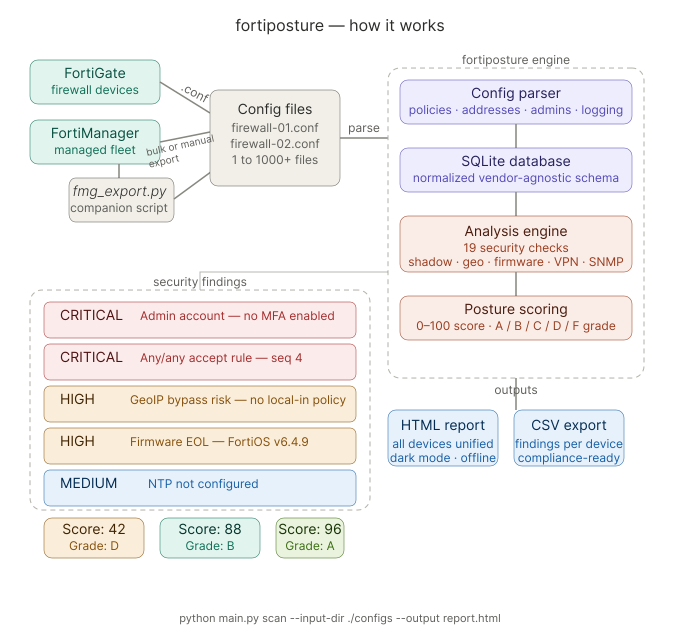

# fortiposture

> Offline security posture assessment for FortiGate firewall configuration backups.

[](https://www.gnu.org/licenses/agpl-3.0)
[](https://www.python.org/)

`fortiposture` is an open source CLI tool that ingests FortiGate firewall configuration backup files (`.conf` and `.txt` formats), parses them, runs automated security posture checks against 19 rule categories, stores all results in a local SQLite database, and generates a self-contained HTML report. It works **entirely offline** — no live firewall connections required.

---

## Table of Contents

- [Features](#features)
- [Quick Start](#quick-start)
- [Installation](#installation)
- [Getting Your Config Files](#getting-your-config-files)
  - [Manual export](#option-1-manual-export)
  - [FortiManager bulk export](#option-2-fortimanager-bulk-export-companion-script)
- [Usage](#usage)
  - [scan command](#scan-command)
  - [All options](#all-options)
- [Security Checks](#security-checks)
- [Scoring & Grading](#scoring--grading)
- [HTML Report](#html-report)
- [CSV Export](#csv-export)
- [Database](#database)
- [Architecture](#architecture)
- [Development](#development)
- [Contributing](#contributing)
- [License](#license)

---

## Features

- **Parse FortiGate `.conf` and `.txt` files** — handles nested config blocks, multi-value sets, quoted values, VDOM-aware configs, and varying firmware versions; `.txt` support covers FortiManager exports
- **19 security checks** across policy rules, admin accounts, logging, password policy, management access, geographic filtering, firmware lifecycle, NTP, VPN cryptography, and SNMP
- **CRITICAL / HIGH / MEDIUM / LOW** severity classification with per-check remediation steps and compliance references (NIST, PCI DSS, CIS)
- **Posture scoring** (0–100) with letter grades (A–F)
- **Self-contained HTML report** — single file, dark/light mode, sortable tables, expandable findings — no CDN or external dependencies
- **CSV export** for integration with spreadsheets and SIEMs
- **SQLite persistence** — results accumulate across runs; re-importing the same file is idempotent (hash-checked)
- **FortiManager companion** (`fmg_export.py`) — a helper script for bulk collection of config files across a managed fleet of FortiGate devices (if you are using FortiManager)

---

## Quick Start

**Windows (no Python required):** Download `fortiposture.exe` from the [latest release](https://github.com/cloud-cyber-guard/fortiposture/releases/latest) and run it directly — no installation needed.

```
.\fortiposture.exe scan --input-dir C:\configs --output report.html
```

Or just double-click / run with no arguments for the interactive wizard:

```
.\fortiposture.exe
```

**Python (pip):**

```bash
pip install fortiposture
fortiposture scan --input-dir ./configs --output report.html
```

Terminal output:

```
fortiposture — scanning 3 file(s) across 3 folder(s) in ./configs

  Parsing fw-core.conf ... 1 device(s)
  Parsing fw-edge.conf ... 1 device(s)
  Parsing fw-dmz.conf  ... 1 device(s)

  Checking fw-core-01 ... 2 critical, 5 high, 1 medium
  Checking fw-edge-01 ... 1 critical, 3 high, 2 medium
  Checking fw-dmz-01  ... clean

  ╭─────────────┬──────────┬──────────┬──────┬────────┬─────┬───────┬───────╮
  │ Device      │ Policies │ Critical │ High │ Medium │ Low │ Score │ Grade │
  ├─────────────┼──────────┼──────────┼──────┼────────┼─────┼───────┼───────┤
  │ fw-core-01  │       18 │        2 │    5 │      1 │   0 │    30 │   F   │
  │ fw-edge-01  │       12 │        1 │    3 │      2 │   0 │    50 │   D   │
  │ fw-dmz-01   │        6 │        0 │    0 │      2 │   0 │    90 │   A   │
  ╰─────────────┴──────────┴──────────┴──────┴────────┴─────┴───────┴───────╯

Report written: report.html
```

---

## Installation

### Windows — standalone executable (no Python required)

Download `fortiposture.exe` from the [latest release](https://github.com/cloud-cyber-guard/fortiposture/releases/latest) Assets section. Copy it anywhere writable (e.g. your Desktop or `C:\Users\username\`) and run it from a command prompt. No admin rights or installation needed.

### Windows / macOS / Linux — pip install

For any platform with Python 3.11+:

```bash
pip install fortiposture
```

If you have multiple Python versions installed, target 3.11+ explicitly:

```bash
python3.11 -m pip install fortiposture
```

On Linux with system Python, you may need `sudo pip install fortiposture` or install with `--user`:

```bash
pip install --user fortiposture
```

Using a virtual environment avoids permission issues entirely (recommended on all platforms):

```bash
python -m venv .venv
source .venv/bin/activate          # Windows: .venv\Scripts\activate
pip install fortiposture
```

### From source (any platform)

```bash
git clone https://github.com/cloud-cyber-guard/fortiposture.git
cd fortiposture
python -m venv .venv
source .venv/bin/activate          # Windows: .venv\Scripts\activate
pip install -e .
```

### Permissions

No elevated privileges are needed to **run** `fortiposture` — it only needs read access to your config files and write access to the output directory. No `sudo`, no admin rights, no network access.

### Requirements

- Python 3.11+ (not needed for the Windows `.exe`)
- Dependencies are installed automatically via `pip install`

| Package | Purpose |
|---------|---------|
| `sqlalchemy >= 2.0` | ORM and SQLite persistence |
| `typer >= 0.12` | CLI argument parsing |
| `rich >= 13.0` | Terminal formatting and tables |
| `alembic >= 1.13` | Database migrations |
| `questionary >= 2.0` | Interactive wizard prompts |

### Verify installation

```bash
fortiposture --help
# or: python main.py --help
```

---

## Getting Your Config Files

`fortiposture` analyses static FortiGate configuration backup files — it never connects to live firewalls. Before you can run a scan, you need to collect config files from your environment. You can do this manually, or use our included companion script to automate the process via FortiManager.

### Option 1: Manual export

These are the same files you get from **System > Configuration > Backup** in the FortiGate web UI, or via CLI:

```bash
execute backup config tftp <filename> <tftp-server-ip>
# or
execute backup full-config flash <filename>
```

Save files with a `.conf` or `.txt` extension and place them in a directory:

```
configs/
├── fw-core.conf
├── fw-edge.conf
└── fw-dmz.conf
```

### Option 2: FortiManager bulk export (companion script)

If you manage multiple FortiGates through FortiManager, the repo includes a companion script (`fmg_export.py`) that connects to your FortiManager instance and downloads config backups for all managed devices in one step. This is the fastest way to collect configs at scale.

```bash
# Install the optional FortiManager dependency
pip install "fortiposture[fmg]"

# Export all managed device configs
python fmg_export.py --host 10.1.1.1 --token <api_token> --output ./configs
```

| Option | Default | Description |
|--------|---------|-------------|
| `--host` | *(required)* | FortiManager IP or hostname |
| `--token` | *(required)* | API token (never username/password) |
| `--output` / `-o` | `./configs` | Directory to save config files |
| `--adom` | `root` | FortiManager ADOM name |
| `--port` | `443` | HTTPS port |
| `--no-ssl-verify` | `false` | Disable SSL certificate verification |

> **Security note:** Only API tokens are accepted. Username/password authentication is intentionally not supported.

Once you have your config files collected (by either method), point `fortiposture scan` at the directory.

---

## Usage

### Interactive mode

Run with no arguments to launch the interactive wizard:

```bash
fortiposture
# or on Windows: .\fortiposture.exe
```

```
? What would you like to do?  > Scan config files (.conf / .txt)
? Input folder path (leave blank for current folder):
? Output format:  > HTML report / CSV export / Both
? Output file name (leave blank for report.html):
```

### scan command

```bash
fortiposture scan --input-dir <path> --output <report.html>
```

Scans all `.conf` and `.txt` files in `--input-dir` (including subdirectories), runs all security checks, and writes an HTML report.

### All options

| Option | Default | Description |
|--------|---------|-------------|
| `--input-dir` / `-i` | *(optional — wizard if omitted)* | Directory containing `.conf` / `.txt` config files |
| `--output` / `-o` | `report.html` | Output HTML report path |
| `--db` | `fortiposture.db` | SQLite database path |
| `--csv` | — | Export all findings to a single CSV file |
| `--csv-dir` | — | Export per-device CSV files to this directory |
| `--severity` | — | Filter findings to this severity and above (`CRITICAL`/`HIGH`/`MEDIUM`/`LOW`) |
| `--device` | — | Only report on devices matching this hostname (substring) |
| `--depth` | `5` | Max subdirectory nesting depth (`0` = root only) |
| `--max-folders` | `100` | Max total folders to visit (safety cap) |
| `--fresh` | `false` | Drop and recreate the database before scanning |
| `--no-color` | `false` | Disable color terminal output |
| `--quiet` / `-q` | `false` | Suppress progress output; only print errors |

### Examples

```bash
# Basic scan
python main.py scan --input-dir ./configs

# Save report and CSV
python main.py scan --input-dir ./configs --output reports/june.html --csv reports/june.csv

# Only show CRITICAL and HIGH findings
python main.py scan --input-dir ./configs --severity HIGH

# Target a specific device
python main.py scan --input-dir ./configs --device fw-core

# Fresh scan (drop previous results)
python main.py scan --input-dir ./configs --fresh

# Per-device CSVs for ticket creation
python main.py scan --input-dir ./configs --csv-dir ./findings/
```

---

## Security Checks

`fortiposture` runs 19 checks across seven categories. See [docs/checks.md](docs/checks.md) for full details on each check including evidence format, remediation steps, and compliance mappings.

### Policy checks

| Check ID | Severity | Condition |
|----------|----------|-----------|
| `ANY_ANY_RULE` | 🔴 CRITICAL | ACCEPT rule with src=any, dst=any, service=ALL |
| `LOGGING_DISABLED` | 🟠 HIGH | ACCEPT rule with traffic logging disabled |
| `SHADOWED_RULE` | 🟠 HIGH | Rule that can never be matched — a broader ACCEPT rule above it covers the same traffic space |
| `RISKY_SERVICE_EXPOSED` | 🟠 HIGH | ACCEPT rule permitting Telnet (23), FTP (21), RDP (3389), TFTP (69), SMB (445), NetBIOS (139), MSSQL (1433), MySQL (3306), or VNC (5900) |
| `MISSING_DENY_ALL` | 🟠 HIGH | No explicit deny-all as the final rule in the policy list |
| `BROAD_DESTINATION` | 🟡 MEDIUM | ACCEPT rule with specific source but destination=any |
| `DISABLED_POLICY` | 🟢 LOW | ACCEPT rule that is disabled (rule bloat indicator) |

### Admin account checks

| Check ID | Severity | Condition |
|----------|----------|-----------|
| `ADMIN_NO_MFA` | 🔴 CRITICAL / 🟠 HIGH | Local admin without MFA — CRITICAL if any super_admin affected, HIGH otherwise. One finding per device. |
| `ADMIN_UNRESTRICTED_ACCESS` | 🟠 HIGH | Admin accounts with no trusted hosts configured. One finding per device. |

### Logging checks

| Check ID | Severity | Condition |
|----------|----------|-----------|
| `LOGGING_NOT_CONFIGURED` | 🟡 MEDIUM | No external logging destination (syslog, FortiAnalyzer, or FortiCloud) enabled |

### Password policy checks

| Check ID | Severity | Condition |
|----------|----------|-----------|
| `WEAK_PASSWORD_POLICY` | 🟡 MEDIUM | Password policy not configured, or minimum length < 8 |

### Management access checks

| Check ID | Severity | Condition |
|----------|----------|-----------|
| `HTTP_ADMIN_ENABLED` | 🟠 HIGH | HTTP (cleartext) enabled for admin access on any interface |
| `MANAGEMENT_ACCESS_EXPOSED` | 🟠 HIGH | HTTPS, SSH, or ping enabled on WAN-facing interfaces (wan1, wan2, port1, etc.) |

### Geographic filtering checks

| Check ID | Severity | Condition |
|----------|----------|-----------|
| `GEOBLOCK_ABSENT` | 🟡 MEDIUM | No geography address objects used in deny policies |
| `GEOBLOCK_BYPASS_RISK` | 🟠 HIGH | Geo blocking active but SSL VPN enabled without matching Local-In policies — blocked countries can still reach the VPN portal |

### Infrastructure checks

| Check ID | Severity | Condition |
|----------|----------|-----------|
| `FIRMWARE_EOL` | 🟠 HIGH / 🟡 MEDIUM / 🟢 LOW | HIGH = FortiOS < 7.0; MEDIUM = 7.0.x or 7.1.x; LOW = version unrecognised; 7.2+ not flagged |
| `NTP_NOT_CONFIGURED` | 🟡 MEDIUM | NTP block absent, ntpsync disabled, or no NTP servers configured |
| `WEAK_CRYPTO_VPN` | 🟠 HIGH / 🟡 MEDIUM | IPSec VPN using weak algorithms — HIGH for DES/3DES/MD5/DH groups 1,2,5; MEDIUM for SHA-1 |
| `SNMP_WEAK_VERSION` | 🟠 HIGH | SNMPv1/v2c communities configured (no auth or encryption; community strings never logged in evidence) |

---

## Scoring & Grading

Each device starts at a score of 100. Points are deducted per finding:

| Severity | Deduction per finding |
|----------|-----------------------|
| CRITICAL | −20 (floor: 0) |
| HIGH | −10 |
| MEDIUM | −5 |
| LOW | −2 |

Letter grades:

| Grade | Score range |
|-------|-------------|
| **A** | 90–100 |
| **B** | 75–89 |
| **C** | 60–74 |
| **D** | 40–59 |
| **F** | 0–39 |

---

## HTML Report

The report is a **single self-contained HTML file** — no external dependencies, no CDN, no fonts loaded from the internet. It can be emailed, archived, or opened offline.

**Report structure:**

- **Header** — timestamp, device count, aggregate stats
- **Summary stats** — total critical/high/medium/low across all devices
- **Executive summary table** — sortable by any column; device, policy count, finding counts by severity, posture score and grade
- **Per-device sections:**
  - Score gauge with letter grade
  - Policy and admin account counts
  - Expandable findings — each finding shows description, numbered remediation steps, compliance references, and raw evidence JSON

**Design:**
- Respects `prefers-color-scheme` — dark mode by default, light mode for print
- Print-friendly (expanded findings don't collapse on print)
- No JavaScript required to read; JS only enables table sorting

---

## CSV Export

CSV files contain one row per finding with the following columns:

| Column | Description |
|--------|-------------|
| `device` | Device hostname |
| `check_id` | Check identifier (e.g. `ANY_ANY_RULE`) |
| `severity` | `CRITICAL` / `HIGH` / `MEDIUM` / `LOW` |
| `title` | Short finding title |
| `affected_object` | Policy name, admin username, or config section |
| `description` | Full finding description |
| `remediation` | Numbered remediation steps |
| `references` | JSON array of compliance references |
| `evidence` | JSON object with raw config values that triggered the finding |

Use `--csv` for a single file covering all devices, or `--csv-dir` to get one file per device.

---

## Database

Results are stored in a SQLite database (`fortiposture.db` by default). The database accumulates findings across runs — re-importing the same config file is safe and idempotent (the file hash is checked before ingestion).

Key tables:

| Table | Contents |
|-------|----------|
| `device` | Hostname, firmware version, source file, import timestamp |
| `firewall_policy` | All parsed policies with action, status, logging, NAT |
| `address_object` | Named address objects |
| `service_object` | Named service objects with port ranges |
| `admin_account` | Admin usernames, auth type, MFA status, trusted hosts |
| `logging_config` | Syslog/FortiAnalyzer/FortiCloud settings |
| `finding` | All check results with severity, description, remediation, evidence |
| `posture_score` | Score and grade per analysis run |
| `analysis_run` | Timestamps and check list for each run |

Use `--fresh` to wipe and recreate the database. Use `--db <path>` to maintain separate databases per project or environment.

---

## Architecture



See [docs/architecture.md](docs/architecture.md) for the full pipeline diagram and module reference.

**At a glance:**

```
.conf files  →  Parser  →  Normalizer  →  SQLite DB  →  Checks  →  Scorer  →  Report
```

1. **Parser** (`fortiposture/parser/conf_parser.py`) — converts raw `.conf`/`.txt` text into a nested Python dict; handles VDOM-aware configs, multi-value sets, quoted strings, nested blocks
2. **Normalizer** (`fortiposture/parser/normalizer.py`) — maps the parsed dict to SQLAlchemy ORM model instances; handles address/service/policy/admin/logging/interface ingestion; idempotent via file hash
3. **Database** (`fortiposture/database.py`) — SQLite via SQLAlchemy ORM; all tables defined in `fortiposture/models/schema.py`
4. **Checks** (`fortiposture/analysis/checks.py`) — 19 independent check functions, each returning a list of `Finding` objects; orchestrated by `run_all_checks()`
5. **Scorer** (`fortiposture/analysis/scoring.py`) — pure function, deducts points by severity, returns (score, grade)
6. **Report** (`fortiposture/output/html_report.py`) — generates the self-contained HTML; `fortiposture/output/csv_export.py` handles CSV

---

## Development

### Setup

```bash
git clone https://github.com/cloud-cyber-guard/fortiposture.git
cd fortiposture
python -m venv .venv && source .venv/bin/activate
pip install -e ".[dev]"
```

### Run tests

```bash
pytest tests/ -v
pytest tests/ -v --cov=fortiposture --cov-report=term-missing
```

### Project structure

```
fortiposture/
├── main.py                         # CLI shim (python main.py scan ...)
├── fmg_export.py                   # FortiManager bulk export
├── pyproject.toml
├── requirements.txt
├── fortiposture/
│   ├── __init__.py
│   ├── cli.py                      # typer app (scan command + interactive wizard)
│   ├── utils.py                    # find_conf_files — recursive .conf/.txt discovery
│   ├── database.py                 # engine, session factory
│   ├── parser/
│   │   ├── conf_parser.py          # .conf → nested dict
│   │   └── normalizer.py           # nested dict → ORM models
│   ├── models/
│   │   └── schema.py               # SQLAlchemy ORM (all tables)
│   ├── analysis/
│   │   ├── checks.py               # 19 security checks
│   │   └── scoring.py              # score + grade calculation
│   └── output/
│       ├── html_report.py          # self-contained HTML report
│       └── csv_export.py           # CSV findings export
├── tests/
│   ├── conftest.py                 # shared pytest fixtures
│   ├── fixtures/                   # synthetic .conf test files
│   │   ├── simple_policy.conf      # clean — 0 expected findings
│   │   ├── any_any_rule.conf       # ANY_ANY_RULE
│   │   ├── shadowed_rules.conf     # SHADOWED_RULE
│   │   ├── missing_deny_all.conf   # MISSING_DENY_ALL
│   │   ├── weak_admin.conf         # ADMIN_NO_MFA + ADMIN_UNRESTRICTED_ACCESS
│   │   ├── multi_vdom.conf         # VDOM-aware config
│   │   ├── management_exposed.conf # HTTP_ADMIN_ENABLED + MANAGEMENT_ACCESS_EXPOSED
│   │   ├── no_geoblock.conf        # GEOBLOCK_ABSENT (no geo objects)
│   │   ├── geoblock_unused.conf    # GEOBLOCK_ABSENT (geo objects not in deny rules)
│   │   ├── geoblock_bypass.conf    # GEOBLOCK_BYPASS_RISK
│   │   ├── geoblock_with_localin.conf # GEOBLOCK_BYPASS_RISK — mitigated
│   │   ├── eol_firmware.conf       # FIRMWARE_EOL (FortiOS v6.4.9)
│   │   ├── no_ntp.conf             # NTP_NOT_CONFIGURED
│   │   ├── weak_vpn.conf           # WEAK_CRYPTO_VPN (3des/md5/dhgrp2)
│   │   ├── strong_vpn.conf         # WEAK_CRYPTO_VPN — clean
│   │   └── weak_snmp.conf          # SNMP_WEAK_VERSION
│   ├── test_parser.py
│   ├── test_normalizer.py
│   ├── test_schema.py
│   ├── test_checks.py
│   ├── test_output.py
│   └── test_utils.py
└── docs/
    ├── checks.md                   # detailed check reference
    └── architecture.md             # pipeline and data flow
```

### Adding a new check

1. Add a function `check_<name>(device, session) -> List[Finding]` in `fortiposture/analysis/checks.py`
2. Add the function to the `ALL_CHECKS` list at the bottom of the file
3. Add a test fixture if a new config pattern is needed
4. Add a test in `tests/test_checks.py`
5. Document the check in `docs/checks.md`

---

## Contributing

Contributions are welcome. Please:

1. Fork the repository and create a feature branch
2. Write tests for any new check or behaviour
3. Ensure `pytest tests/ -v` passes
4. Open a pull request with a description of what the check detects and why it matters

---

## License

`fortiposture` is licensed under the [GNU Affero General Public License v3.0](LICENSE).

Copyright (C) 2026 cloud-cyber-guard

> This program is free software: you can redistribute it and/or modify it under the terms of the GNU Affero General Public License as published by the Free Software Foundation, either version 3 of the License, or (at your option) any later version.

---

> **Disclaimer:** This tool is provided for informational and audit purposes only. Findings should be reviewed by a qualified network security engineer before any remediation actions are taken. The authors accept no liability for actions taken based on this tool's output.
