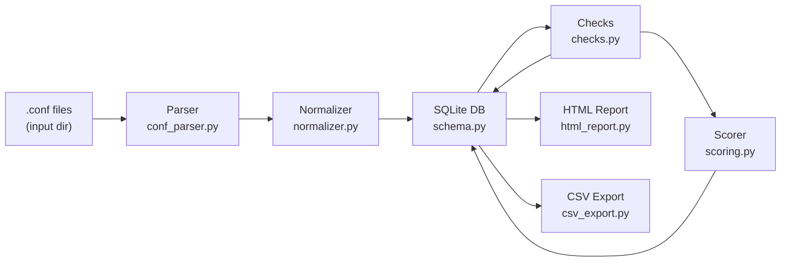
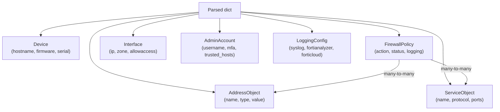
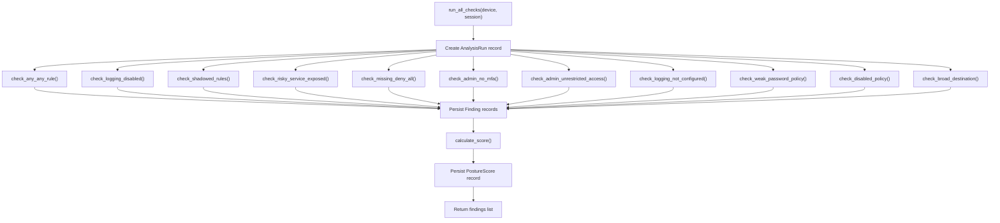

# Architecture

This document describes the internal design of `fortiposture` — how data flows from raw `.conf` files to a finished HTML report.

---

## Pipeline Overview

`fortiposture` is a linear pipeline. Each stage has a clean input/output contract and can be tested in isolation.

```
┌──────────────┐    ┌──────────────┐    ┌──────────────┐    ┌──────────────┐    ┌──────────────┐    ┌──────────────┐
│  .conf files │───▶│    Parser    │───▶│  Normalizer  │───▶│   SQLite DB  │───▶│    Checks    │───▶│    Report    │
└──────────────┘    └──────────────┘    └──────────────┘    └──────────────┘    └──────────────┘    └──────────────┘
  Raw text           Nested dict         ORM model             Persisted           Finding list        HTML / CSV
                                         instances             records             + scores
```

As a Mermaid diagram:



---

## Data Flow

### 1. Discovery (CLI)

`fortiposture/cli.py` globs `*.conf` from `--input-dir`. Files are processed in sorted order.

### 2. Parsing

**Module:** `fortiposture/parser/conf_parser.py`
**Class:** `FortiConfParser`
**Input:** `Path` to a `.conf` file
**Output:** Nested `dict` mirroring the config block hierarchy

FortiGate config files use a hierarchical block format:

```
config <section>
    edit <id or name>
        set <key> <value>
        config <nested-section>
            edit <id>
                set <key> <value>
            next
        end
    next
end
```

The parser handles:
- `next` / `end` block delimiters
- Multi-value `set` statements: `set srcaddr "net1" "net2" "net3"` → list
- Quoted and unquoted values with `shlex` fallback
- Nested `config` blocks inside `edit` blocks
- VDOM-aware configs: detects `config vdom` sections and parses each VDOM separately
- Missing sections (returns empty dict, does not raise)
- Fault-tolerant: parse warnings are logged; processing continues

**Example output structure:**

```python
{
  "system global": {"hostname": "fw-core-01", "timezone": "04"},
  "firewall policy": {
    "1": {"name": "mgmt", "srcaddr": ["MGMT-NET"], "action": "accept", ...},
    "2": {"name": "deny-all", "action": "deny", ...},
  },
  "system admin": {
    "admin": {"two-factor": "fortitoken", "trusthost1": "10.0.0.0/8"},
  },
  ...
}
```

### 3. Normalization

**Module:** `fortiposture/parser/normalizer.py`
**Class:** `FortiNormalizer`
**Input:** Parsed dict + source file `Path` + SQLAlchemy `Session`
**Output:** List of `Device` ORM instances (one per VDOM for VDOM-aware configs)

The normalizer maps parsed config sections to ORM model instances:



**Idempotency:** Before ingesting a file, the normalizer computes a SHA-256 hash of the file content and checks whether a `Device` record with the same `(hostname, vdom, source_file_hash)` already exists. If it does, the file is skipped — re-running the same scan twice does not duplicate findings.

**VDOM handling:** VDOM-aware configs contain a `config vdom` block with named VDOMs. Each VDOM gets its own `Device` record with `vdom=<name>`, so findings are scoped per VDOM.

### 4. Storage

**Module:** `fortiposture/database.py`
**Schema:** `fortiposture/models/schema.py`

All data is stored in SQLite via SQLAlchemy ORM. The database accumulates records across multiple scan runs.

```mermaid
erDiagram
    Device ||--o{ FirewallPolicy : has
    Device ||--o{ AddressObject : has
    Device ||--o{ ServiceObject : has
    Device ||--o{ AdminAccount : has
    Device ||--o{ LoggingConfig : has
    Device ||--o{ AnalysisRun : has
    Device ||--o{ Finding : has
    Device ||--o{ PostureScore : has
    AnalysisRun ||--o{ Finding : contains
    AnalysisRun ||--o| PostureScore : produces
    FirewallPolicy }o--o{ AddressObject : src/dst
    FirewallPolicy }o--o{ ServiceObject : service
```

### 5. Analysis

**Module:** `fortiposture/analysis/checks.py`
**Function:** `run_all_checks(device, session) -> List[Finding]`

Each check is an independent function with the signature:

```python
def check_<name>(device: Device, session: Session) -> List[Finding]:
    ...
```

All checks are registered in the `ALL_CHECKS` list. `run_all_checks()` iterates this list, catches exceptions per-check (a failing check does not abort the others), collects all `Finding` objects, persists them, and calls the scorer.



### 6. Scoring

**Module:** `fortiposture/analysis/scoring.py`
**Function:** `calculate_score(critical, high, medium, low) -> (int, str)`

Pure function — no database or ORM dependencies.

```
score = 100
score -= critical * 20
score -= high * 10
score -= medium * 5
score -= low * 2
score = max(score, 0)

grade = A (90-100) | B (75-89) | C (60-74) | D (40-59) | F (0-39)
```

### 7. Output

**HTML report** (`fortiposture/output/html_report.py`)

`generate_html_report(devices, session, out_path)` queries the database for each device's latest `PostureScore` and all `Finding` records, then renders a single self-contained HTML string written to `out_path`. All CSS and JavaScript are inlined — no external requests are made at render time or when the file is opened in a browser.

**CSV export** (`fortiposture/output/csv_export.py`)

`export_findings_csv(findings, out_path)` writes a flat CSV of `Finding` objects. `None` values are replaced with empty strings to avoid literal "None" in output.

---

## Module Reference

| Module | Responsibility |
|--------|---------------|
| `fortiposture/cli.py` | `typer` app; `scan` command; orchestrates the full pipeline |
| `fortiposture/database.py` | `get_engine()`, `init_db()`, `drop_db()`, `get_session()` |
| `fortiposture/models/schema.py` | All SQLAlchemy ORM models and association tables |
| `fortiposture/parser/conf_parser.py` | `FortiConfParser` — raw text → nested dict |
| `fortiposture/parser/normalizer.py` | `FortiNormalizer` — nested dict → ORM model instances |
| `fortiposture/analysis/checks.py` | 11 check functions + `run_all_checks()` orchestrator |
| `fortiposture/analysis/scoring.py` | `calculate_score()` — pure scoring function |
| `fortiposture/output/html_report.py` | `generate_html_report()` — self-contained HTML |
| `fortiposture/output/csv_export.py` | `export_findings_csv()` — flat CSV findings |
| `main.py` | Thin shim; delegates to `fortiposture.cli:app` for direct invocation |
| `fmg_export.py` | FortiManager bulk config export via `pyfortimanager` API |

---

## Design Decisions

### Offline-only operation

`fortiposture` never connects to live firewalls during analysis. All data comes from static `.conf` backup files. This means it can run in air-gapped environments, CI pipelines, or analyst workstations without firewall credentials or network access.

The only exception is `fmg_export.py`, which is an optional companion script for pulling configs from FortiManager. It is a separate file with optional dependencies.

### SQLite persistence

Results accumulate in SQLite across runs. This enables:
- Trend analysis (score over time, new findings vs. resolved findings)
- Incremental scans (only re-scan changed files via hash check)
- Downstream tooling (query the DB with any SQLite client)

Use `--fresh` to reset when you want a clean state.

### Fault-tolerant parser

The parser logs warnings and continues on malformed sections rather than raising exceptions. This is intentional — real-world FortiGate configs can have firmware-specific syntax that the parser doesn't recognise. A partial parse that surfaces most findings is more useful than a hard failure.

### Self-contained HTML

The HTML report intentionally loads nothing from the internet. This ensures:
- Reports can be viewed and archived offline
- Reports can be emailed without external dependencies breaking
- No data is inadvertently sent to CDN providers when the report is opened

### No credentials stored anywhere

`fortiposture` never stores passwords or API keys. The database stores only config data parsed from `.conf` files. Admin passwords are not included in FortiGate config backups (they are stored as hashes, and hashes are not ingested).
